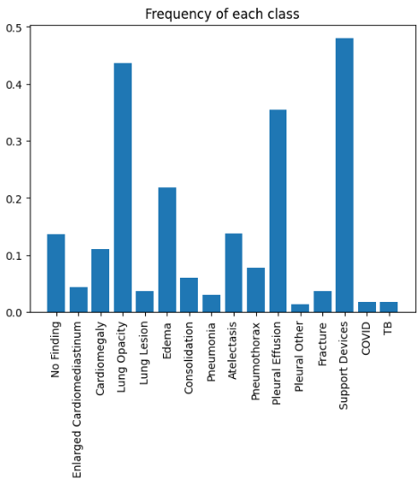
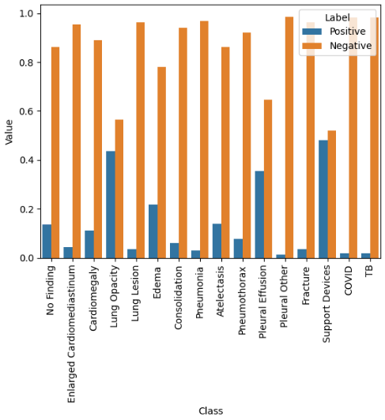
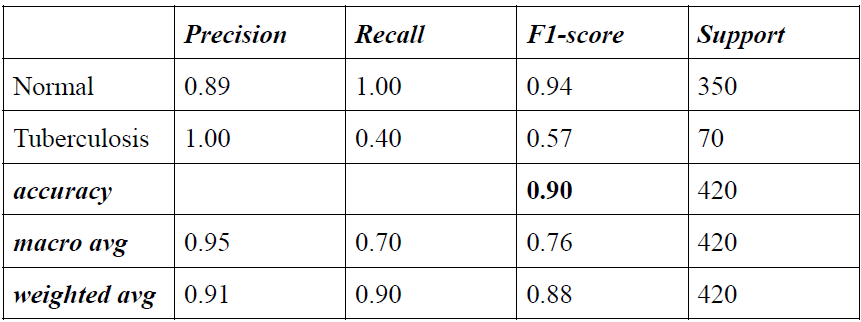
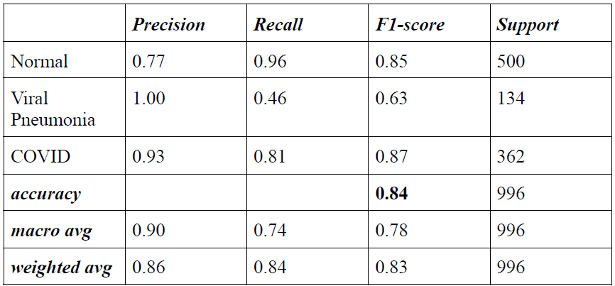
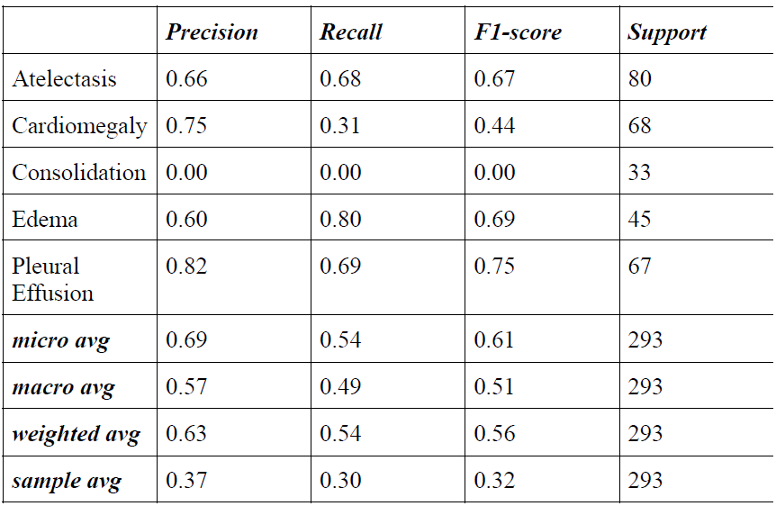
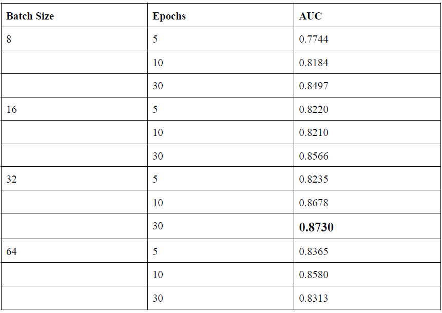

# Chest_X-Ray_Anomaly_Detection

This project aims to facilitate global health diagnosis via a large-scale screening system and practical tools & services. In this work, multiple datasets are explicit, including CheXpert(Chest eXpert), COVID, Pneumonia, and TB datasets. The main contribution of this work is to detect the 8 most significant pathology in the medical history of Chest X-Ray via a pathological hierarchical approach. The report discusses the use of multiple pre-trained models on the combined dataset, and further custom architectures have been trained from scratch to generate detection results. The results suggest the models built from transfer learning clearly supersedes the model trained from scratch. Separate datasets of COVID, Pneumonia, and TB are integrated into the CheXpert dataset. The entire work has been focused on improving the AUC score for detecting the following 8 classes- Atelectasis, Cardiomegaly, Consolidation, Edema, Pneumonia, Pleural Effusion, COVID, and TB. The proposed methods for label handling and AUC maximization achieve excellent performance with an AUC score of 0.8730 for classifying the above-mentioned 8 classes. The training pipeline and AUC maximization methods can be easily implemented to classify diseases in the Chest radiography dataset.

## Dataset

Chest X-rays datasets are taken from multiple sources:

1. [TB](https://www.kaggle.com/datasets/tawsifurrahman/tuberculosis-tb-chest-xray-dataset) - The database consists of Chest X-ray images for Tuberculosis (TB) positive cases and Normal images. There are 3500 Normal and 700 TB images publicly accessible.
2. [COVID & Pneumonia](https://github.com/ieee8023/covid-chestxray-dataset) - The database consists of Chest X-Ray images for COVID, Pneumonia, and Normal images. 5000 Normal, 3600 COVID and 1250 Pneumonia images are publicly accessible
3. [CheXpert](https://stanfordmlgroup.github.io/competitions/chexpert/) - CheXpert is a large chest X-ray dataset with uncertainty labels and radiologist-labeled reference standard evaluation sets. The dataset contains 224,316 chest radiographs of 65,240 patients. There are 14 classes of pathology, including, Enlarged Cardiomediastinum, Cardiomegaly, Lung Opacity, Lung Lesion, Edema, Consolidation, Pneumonia, Atelectasis, Pneumothorax, Pleural Effusion, Pleural Other, Fracture, Support Devices, No Finding.

The datasets are combined to generate a single dataframe after normalizing the features of each data sample.

**Final Dataset**

The final dataset consists of 16 classes in addition to 14 classes in CheXpert as COVID, and TB datasets have been added to the CheXpert dataset, and the explicit Pneumonia dataset is appended under the existing class of Pneumonia in CheXpert. Therefore, the final dataset of Chest X-rays consists of 238,957 images of 16 classes with positive(1), negative(0), and uncertain labels(-1). The prevalence or frequency of each class has been reported in the figure below:

   

## Methodology

1. Addressing Data imbalance
2. Weighted loss function
3. Medical Label Hierarchy
4. Handling Uncertain labels

## Results

**TB Dataset**

 

**COVID & Pneumonia Dataset**

 

**CheXpert**

 

**Results on the final & combined dataset after employing the above-mentioned methodologies**

 
